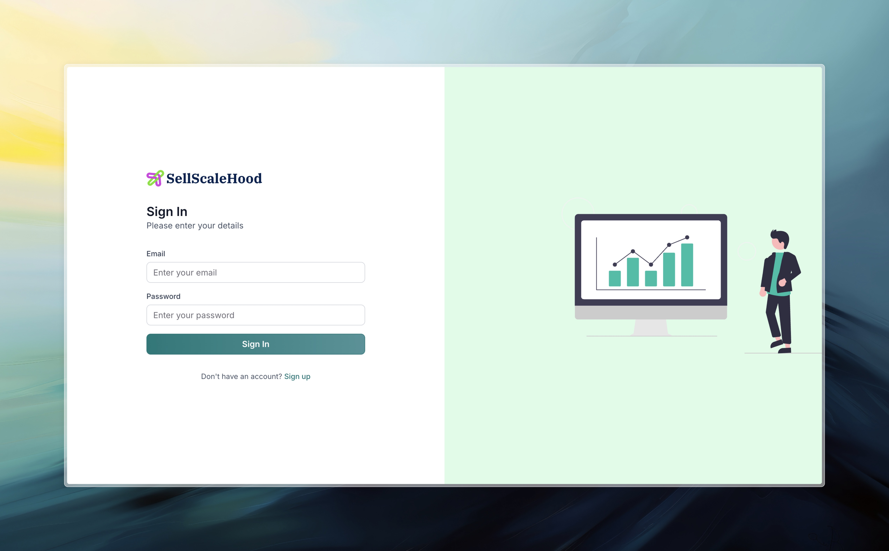
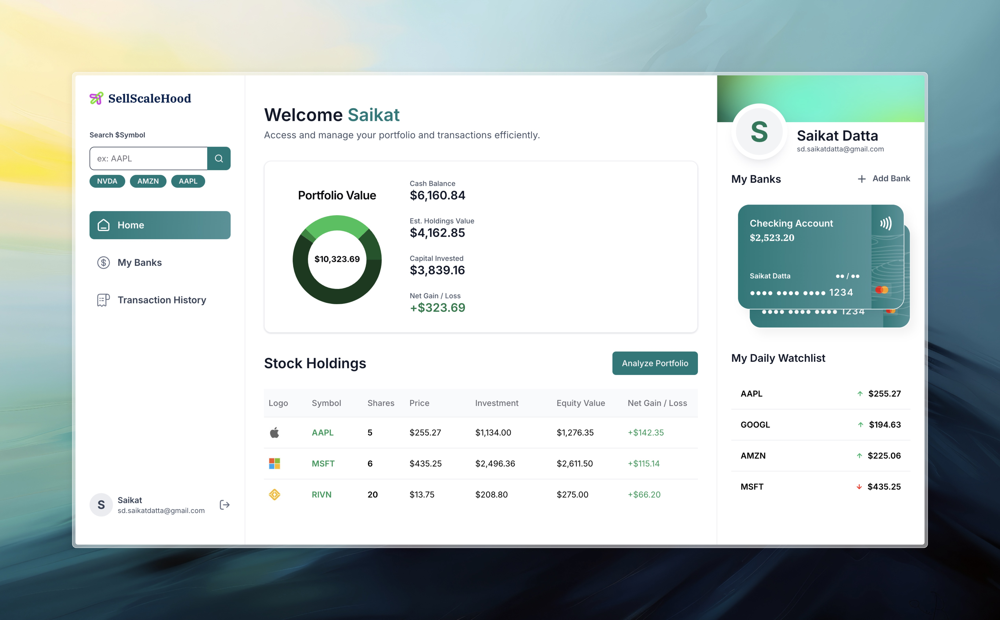
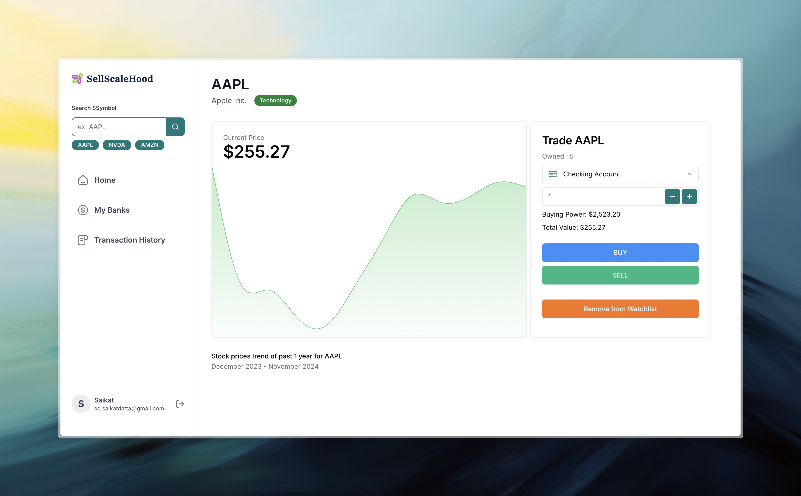

## SellScaleHood

A full stack basic implementation of Robinhood, where one can sign-up and trade stocks.

Built for SellScale.


Demo 1 (For end-users) : [Link](https://www.loom.com/share/20ca8c673e0a455b96bef234b9ecc506?sid=7f721877-ef2d-4158-b2b6-51313e90991b)

Demo 2 (For engineers) : [Link](https://www.loom.com/share/780c8d0a24f0492bb2bef81f6565fed8?sid=68903e4f-efeb-49e7-b461-54517284ea20)

### Preview

<br><br>
<br><br>
<br><br>

### Features

- [x] User authentication
- [x] Search for a Stock symbol
- [x] See user portfolio
- [x] See a stock details page
- [x] Add/Remove a stock from their watchlist
- [x] Buy/Sell stocks
- [x] View their trading history

### Improvements

- [ ] Ability to Add/withdraw funds from the bank accounts
- [ ] Ability to add/remove the linked bank accounts
- [ ] Unit and E2E tests
- [ ] Live updating stock values
- [ ] Ability to buy fractional stocks based on money
- [ ] Fix breaking mobile responsiveness

### Technologies


### Prerequisites

- Install python 3.x from official website
- Install nodejs

```
brew install nvm
nvm install 20
```

- Install redis

```
brew install redis
```

- Clone this repository to your local system.

### Steps to run the project

- cd into the location where you have cloned this repository
- setup and activate a python virtual env

```
pip3 -m venv .venv

source ./venv/bin/activate
```

- cd into the server directory
- install the python libraries from requirements

```
pip3 install -r requirements.txt
```

- set FLASK environment variables

```
export FLASK_APP = app.py
export FLASK_ENV = development
```

- copy the .env.example filed to a new file named ".env"
- set the SECRET_KEY=XXXXXXXXXXXXX where the Xs are any string you want to.
- set the OPENAI_API_KEY=XXXXXXXXXXXXX where the Xs are the OpenAI Api key of your account.

- start a redis server

```
redis-server
```

- open a new terminal at the server directory location and run the flask app

```
flask run --reload
```

- open a new terminal at the client directory of the project folder
- install node dependencies

```
npm install
```

- run the frontend application

```
npm run dev
```

- Go to http://localhost:3000/ to access the application
